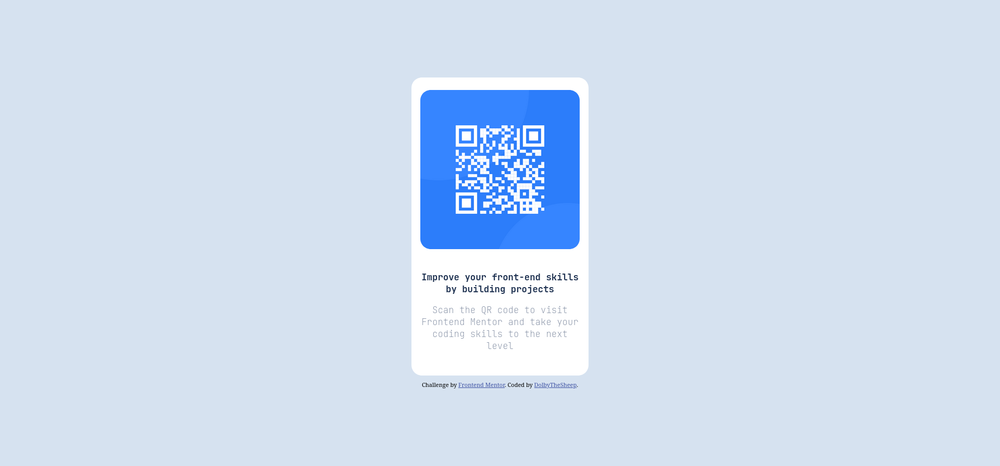

# Frontend Mentor - QR code component solution

This is a solution to the [QR code component challenge on Frontend Mentor](https://www.frontendmentor.io/challenges/qr-code-component-iux_sIO_H). Frontend Mentor challenges help you improve your coding skills by building realistic projects. 

## Table of contents

- [Overview](#overview)
  - [Screenshot](#screenshot)
  - [Links](#links)
- [My process](#my-process)
  - [Built with](#built-with)
  - [What I learned](#what-i-learned)
  - [Continued development](#continued-development)

## Overview

### Screenshot

|Desktop                                                | Mobile                                              |
|-------------------------------------------------------|-----------------------------------------------------|
|||


### Links

- Solution URL: [Add solution URL here](https://github.com/DolbyTheSheep/QR-Code-Component.git)
- Live Site URL: [Add live site URL here](https://dolbythesheep.github.io/QR-Code-Component/)

## My process

### Built with

- Semantic HTML5 markup
- CSS custom properties
- Flexbox

### What I learned

I learned to use Flexbox to align an item to the center

```css
main {
  display: flex;
  flex-direction: column;
  justify-content: center;
  align-items: center;
}
```

### Continued development

I'd like to learn more about the use of Flexbox to create more complex patterns.